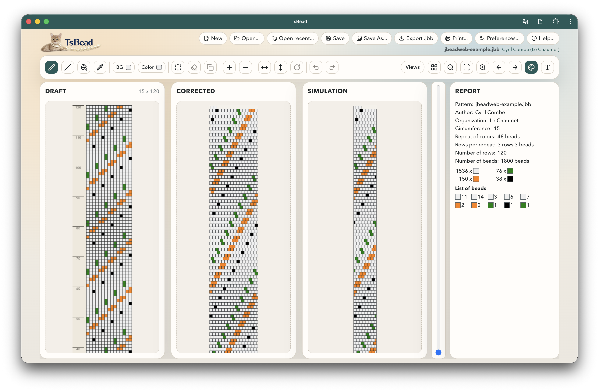

# TsBead

TsBead is a TypeScript port of the excellent original work done by Damian Brunold on JBead.

This modern web rewrite is focused on:
- no Java runtime required
- browser-first usage
- offline local persistence
- compatibility with existing `.jbb` files

## Live App

- URL: https://cyrilcombe.github.io/tsbead/



## Install As PWA

### Desktop (Chrome / Edge)

1. Open the app: https://cyrilcombe.github.io/tsbead/
2. Click the install icon in the address bar (or browser menu > Install app).
3. Launch TsBead from your applications list like a native app.

### Android (Chrome)

1. Open the app URL in Chrome.
2. Tap `Add to Home screen` or `Install app`.
3. Confirm installation.

### iPhone / iPad (Safari)

1. Open the app URL in Safari.
2. Tap `Share`.
3. Tap `Add to Home Screen`.

### Update The Installed App

1. Open TsBead while online.
2. Refresh once.
3. If needed, close and reopen the installed app.

## File Format Scope

- Supported in web app: `.jbb`
- Legacy `.dbb` format: not supported

## Keyboard Shortcuts

| Action | macOS | Windows / Linux |
|---|---|---|
| New file | `Cmd+N` | `Ctrl+N` |
| Open file | `Cmd+O` | `Ctrl+O` |
| Open recent | `Cmd+Shift+O` | `Ctrl+Shift+O` |
| Save | `Cmd+S` | `Ctrl+S` |
| Save as | `Cmd+Shift+S` | `Ctrl+Shift+S` |
| Print | `Cmd+P` | `Ctrl+P` |
| Preferences | `Cmd+,` or `Cmd+Shift+P` | `Ctrl+,` or `Ctrl+Shift+P` |
| Undo | `Cmd+Z` | `Ctrl+Z` |
| Redo | `Cmd+Shift+Z` | `Ctrl+Y` |
| Pencil tool | `Cmd+1` | `Ctrl+1` |
| Line tool | `Cmd+2` | `Ctrl+2` |
| Fill tool | `Cmd+3` | `Ctrl+3` |
| Select tool | `Cmd+4` | `Ctrl+4` |
| Delete selection | `Cmd+5` | `Ctrl+5` |
| Pipette tool | `Cmd+6` | `Ctrl+6` |
| Zoom in | `Cmd+I` | `Ctrl+I` |
| Zoom out | `Cmd+U` | `Ctrl+U` |
| Arrange selection | `F8` | `F8` |
| Select palette color | `0-9` | `0-9` |
| Shift pattern left/right | `← / →` | `← / →` |
| Clear selection / close dialogs | `Escape` | `Escape` |
| Temporary pipette (hold) | `Space` | `Space` |

## Gestures

- Pinch with two fingers on the canvas to zoom in and out.
- Swipe left or right with two fingers on the canvas to shift the pattern phase.

## Credits

- Original author: Damian Brunold
- JBead website: https://www.jbead.ch/
- JBead GitHub: https://github.com/damianbrunold/jbead

## Tech Stack

- React + TypeScript + Vite
- Zustand for editor state
- Dexie/IndexedDB for local storage
- Vitest for tests

## Development, Tests, Build

### Development

```bash
npm install
npm run dev
```

### Tests

```bash
npm run test
```

### Build

```bash
npm run build
```

## License

GPLv3 (same as original JBead).
See `LICENSE` and `NOTICE`.
